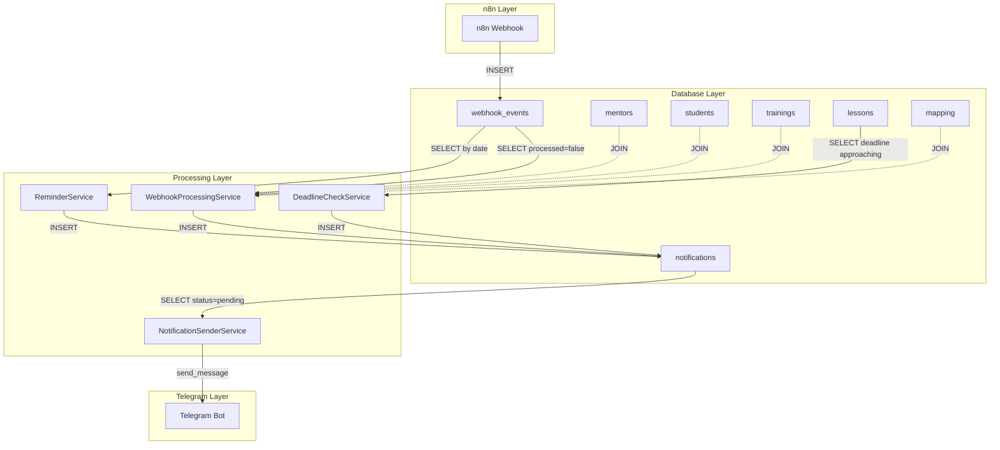

# Рефакторинг GetCourse Bot - Фаза 3: Миграция бизнес-логики (GAS → Python)

**Статус:** ✅ Завершено
**Дата:** 2025-12-21
**Ветка:** `refactoring/phase3-business-logic`

---

## Цель Фазы 3

Полная миграция бизнес-логики обработки вебхуков и уведомлений из Google Apps Script в Python-сервисы с использованием PostgreSQL и APScheduler.

**Результат:** Проект GAS полностью архивирован и не используется.

---

## Что было сделано

### 1. ✅ Создано 5 новых Python-сервисов

#### 1.1. `bot/services/notification_calculator.py`

**Назначение:** Форматирование сообщений и проверка дубликатов

**Основные методы:**
- `format_answer_notification()` - сообщение о новом ответе
- `format_deadline_notification()` - сообщение о приближающемся дедлайне
- `format_reminder_notification()` - сообщение-напоминание
- `check_duplicate_notification()` - проверка дубликатов

**Миграция из GAS:**
- `lessonHandlers.gs:81-92` → `format_answer_notification()`
- `deadlineHandlers.gs:152-163` → `format_deadline_notification()`
- `reminderHandlers.gs:115-142` → `format_reminder_notification()`
- `deadlineHandlers.gs:112-132` → `check_duplicate_notification()`

#### 1.2. `bot/services/webhook_processor.py`

**Назначение:** Обработка вебхуков из таблицы `webhook_events`

**Основные методы:**
- `process_pending_webhooks()` - главный метод (запускается каждые 30 сек)
- `process_answer_to_lesson()` - обработка ответа на урок
- `find_mentor_for_student()` - поиск наставника через mapping
- `get_lesson_info()` - получение данных урока
- `get_training_info()` - получение данных тренинга
- `create_notification()` - создание записи в `notifications`

**Миграция из GAS:**
- `lessonHandlers.gs:16-105` → `process_answer_to_lesson()`

**Ключевые изменения:**
- Использует SQLAlchemy async queries вместо Google Sheets API
- Работает с PostgreSQL views (`v_active_mentors`, `v_active_students`, `v_active_mappings`)
- Обрабатывает только записи с `processed = false`
- После обработки устанавливает `processed = true`, `processed_at = NOW()`

#### 1.3. `bot/services/deadline_checker.py`

**Назначение:** Проверка приближающихся дедлайнов

**Основные методы:**
- `check_deadlines()` - главный метод (запускается каждый час)
- `get_approaching_deadlines()` - получение уроков с дедлайнами в пределах 36 часов
- `get_students_without_answers()` - студенты без ответов на урок
- `group_students_by_mentor()` - группировка студентов по наставникам

**Миграция из GAS:**
- `deadlineHandlers.gs:9-182` → `check_deadlines()`

**Логика:**
1. Получает уроки с `deadline_date` в пределах 36 часов от текущего момента
2. Для каждого урока определяет студентов без ответов (проверка в `webhook_events`)
3. Группирует студентов по наставникам через `mapping`
4. Проверяет дубликаты для каждого студента (по имени + урок + дедлайн)
5. Создает уведомления для наставников

#### 1.4. `bot/services/reminder_service.py`

**Назначение:** Напоминания о непроверенных ответах

**Основные методы:**
- `process_reminder_notifications()` - главный метод (запускается раз в день в 12:00 MSK)
- `get_answers_for_date()` - получение ответов за определенную дату
- `group_answers_by_mentor()` - группировка по наставникам

**Миграция из GAS:**
- `reminderHandlers.gs:9-108` → `process_reminder_notifications()`

**Логика:**
1. Анализирует ответы студентов за дату (по умолчанию 2 дня назад)
2. Группирует ответы по наставникам
3. Создает напоминания для каждого наставника
4. Сортирует студентов по времени ответа

#### 1.5. `bot/services/notification_sender.py`

**Назначение:** Отправка уведомлений в Telegram

**Основные методы:**
- `send_pending_notifications()` - главный метод (запускается каждые 15 сек)
- `get_mentor_by_id()` - получение данных ментора
- `send_notification_to_telegram()` - отправка с retry

**Функции:**
- Читает уведомления со статусом `pending` (батчами по 20 шт)
- Проверяет наличие `telegram_id` у ментора
- Отправляет в Telegram с retry (exponential backoff)
- Обновляет статус: `sent`, `failed`, `no_telegram_id`
- Задержка 0.5 сек между отправками

---

### 2. ✅ Обновлена авторизация (миграция на PostgreSQL)

**Файл:** `bot/handlers/auth.py`

**Что изменено:**
- ❌ Удалены импорты: `get_mentor_by_email`, `register_telegram_id`, `ApiError`
- ❌ Удалены вызовы GAS API
- ✅ Прямая работа с PostgreSQL таблицей `mentors`
- ✅ Проверка активных менторов: `valid_to = '9999-12-31'`
- ✅ Обновление `telegram_id` и `username` после регистрации

**Новая логика:**
```python
# Поиск ментора по email в PostgreSQL
mentor_query = select(Mentor).where(
    Mentor.email == email,
    Mentor.valid_to == datetime(9999, 12, 31, tzinfo=pytz.UTC)
)
mentor = await session.execute(mentor_query)

if not mentor:
    # Email не найден
    return

# Обновление telegram_id
mentor.telegram_id = message.from_user.id
mentor.username = message.from_user.username
await session.commit()
```

**Роли пользователей:**
- **Наставник:** Любой пользователь с `telegram_id` в таблице `mentors` (поле `valid_to = '9999-12-31'`)
- **Администратор:** Наставник, чей `telegram_id` указан в переменной окружения `ADMIN_IDS`

---

### 3. ✅ Обновлен `main.py` - новые задачи APScheduler

**Добавлены задачи:**

#### Задача 1: Обработка вебхуков
```python
scheduler.add_job(
    webhook_processor.process_pending_webhooks,
    'interval',
    seconds=config.webhook_processing_interval,  # По умолчанию 30 сек
    id='process_webhooks'
)
```

#### Задача 2: Проверка дедлайнов
```python
scheduler.add_job(
    deadline_checker.check_deadlines,
    'interval',
    minutes=config.deadline_check_interval_minutes,  # По умолчанию 60 мин
    id='check_deadlines'
)
```

#### Задача 3: Отправка уведомлений
```python
scheduler.add_job(
    notification_sender.send_pending_notifications,
    'interval',
    seconds=config.notification_send_interval,  # По умолчанию 15 сек
    id='send_notifications'
)
```

#### Задача 4: Напоминания (раз в день)
```python
scheduler.add_job(
    reminder_service.process_reminder_notifications,
    'cron',
    hour=config.reminder_trigger_hour,  # По умолчанию 12:00 MSK
    timezone='Europe/Moscow',
    id='process_reminders'
)
```

**Удалены старые задачи:**
- ❌ `check_new_notifications` (работа через GAS API)

---

### 4. ✅ Обновлена конфигурация

**Файл:** `bot/config.py`

**Новые параметры:**
```python
# Интервалы обработки
self.webhook_processing_interval = int(os.getenv("WEBHOOK_PROCESSING_INTERVAL", "30"))
self.deadline_check_interval_minutes = int(os.getenv("DEADLINE_CHECK_INTERVAL_MINUTES", "60"))
self.notification_send_interval = int(os.getenv("NOTIFICATION_SEND_INTERVAL", "15"))

# Параметры дедлайнов
self.deadline_warning_hours = int(os.getenv("DEADLINE_WARNING_HOURS", "36"))

# Параметры напоминаний
self.reminder_trigger_hour = int(os.getenv("REMINDER_TRIGGER_HOUR", "12"))
self.reminder_analysis_days_back = int(os.getenv("REMINDER_ANALYSIS_DAYS_BACK", "2"))

# Лимиты обработки
self.webhook_batch_size = int(os.getenv("WEBHOOK_BATCH_SIZE", "50"))
self.notification_batch_size = int(os.getenv("NOTIFICATION_BATCH_SIZE", "20"))
```

**Файл:** `env.example`

Добавлены соответствующие переменные окружения с комментариями.

---

### 5. ✅ Обновлены зависимости

**Файл:** `requirements.txt`

**Добавлено:**
- `pytz==2024.1` - для работы с московским временем

---

## Архитектура решения



---

## Работа с временными зонами

### Принципы

1. **БД (PostgreSQL)**: Все TIMESTAMPTZ хранятся в UTC
2. **Python**: `datetime.now(pytz.UTC)` для получения текущего времени
3. **Отображение**: Конвертация в `Europe/Moscow` только для показа пользователю

### DBeaver отображение

- DBeaver показывает даты в локальной временной зоне компьютера
- **Реальное значение в БД: UTC**
- Пример: БД хранит `2025-12-21 18:50:57+00`, DBeaver показывает `2025-12-21 21:50:57`

### Амвера сервер

- Системное время: UTC
- Отставание от Москвы: 3 часа
- Для крон-задач используем `timezone='Europe/Moscow'` в APScheduler

### Пример кода

```python
import pytz
from datetime import datetime

# Текущее время в UTC
now_utc = datetime.now(pytz.UTC)

# Конвертация в московское время
moscow_tz = pytz.timezone('Europe/Moscow')
now_moscow = now_utc.astimezone(moscow_tz)

# Форматирование для отображения
formatted = now_moscow.strftime('%d-%m-%Y %H:%M')
print(f"Московское время: {formatted} (МСК)")
```

### Проверка настроек PostgreSQL

```sql
-- Проверка текущей временной зоны сервера
SHOW timezone;

-- Проверка как хранится TIMESTAMPTZ
SELECT
    '2025-12-21 18:50:57+00'::TIMESTAMPTZ as utc_input,
    '2025-12-21 18:50:57+00'::TIMESTAMPTZ AT TIME ZONE 'Europe/Moscow' as moscow_display;

-- Проверка реальных значений в webhook_events
SELECT
    id,
    event_date,
    event_date AT TIME ZONE 'UTC' as event_date_utc,
    event_date AT TIME ZONE 'Europe/Moscow' as event_date_moscow,
    created_at
FROM webhook_events
ORDER BY id DESC
LIMIT 5;
```

---

## Конфигурационные параметры

### Переменные окружения (.env)

```bash
# ===== НАСТРОЙКИ ОБРАБОТКИ ВЕБХУКОВ И УВЕДОМЛЕНИЙ =====

# Интервал обработки вебхуков (в секундах)
WEBHOOK_PROCESSING_INTERVAL=30

# Интервал проверки дедлайнов (в минутах)
DEADLINE_CHECK_INTERVAL_MINUTES=60

# Интервал отправки уведомлений (в секундах)
NOTIFICATION_SEND_INTERVAL=15

# Время до дедлайна для отправки уведомлений (в часах)
DEADLINE_WARNING_HOURS=36

# Час запуска напоминаний о непроверенных ответах (по московскому времени)
REMINDER_TRIGGER_HOUR=12

# Количество дней назад для анализа непроверенных ответов
REMINDER_ANALYSIS_DAYS_BACK=2

# Размер батча для обработки вебхуков
WEBHOOK_BATCH_SIZE=50

# Размер батча для отправки уведомлений
NOTIFICATION_BATCH_SIZE=20
```

### Рекомендуемые значения

| Параметр | Dev | Prod | Описание |
|----------|-----|------|----------|
| WEBHOOK_PROCESSING_INTERVAL | 60 | 30 | Частая проверка в prod для быстрого ответа |
| DEADLINE_CHECK_INTERVAL_MINUTES | 120 | 60 | Дедлайны не критичны к скорости |
| NOTIFICATION_SEND_INTERVAL | 30 | 15 | Быстрая доставка уведомлений |
| DEADLINE_WARNING_HOURS | 36 | 36 | Как в GAS |
| WEBHOOK_BATCH_SIZE | 10 | 50 | Меньше батчи в dev для отладки |
| NOTIFICATION_BATCH_SIZE | 5 | 20 | Меньше батчи в dev для отладки |

---

## Подготовка к запуску

### 1. Заполнение справочных данных

**ВАЖНО:** Данные из GAS НЕ мигрируются. Все заполняется вручную через DBeaver.

#### 1.1. Таблица `mentors`

```sql
-- Новые менторы (telegram_id = NULL, заполнится после регистрации)
INSERT INTO mentors (mentor_id, email, first_name, last_name, valid_from, valid_to)
VALUES
  (101, 'mentor1@example.com', 'Иван', 'Иванов', NOW(), '9999-12-31'::TIMESTAMPTZ),
  (102, 'mentor2@example.com', 'Петр', 'Петров', NOW(), '9999-12-31'::TIMESTAMPTZ);

-- Старые менторы (с telegram_id из предыдущей базы)
INSERT INTO mentors (mentor_id, email, first_name, last_name, telegram_id, username, valid_from, valid_to)
VALUES
  (103, 'old_mentor@example.com', 'Сергей', 'Сергеев', 123456789, 'sergey_mentor', NOW(), '9999-12-31'::TIMESTAMPTZ);
```

#### 1.2. Таблица `students`

```sql
INSERT INTO students (student_id, user_email, first_name, last_name, valid_from, valid_to)
VALUES
  (201, 'student1@example.com', 'Анна', 'Смирнова', NOW(), '9999-12-31'::TIMESTAMPTZ),
  (202, 'student2@example.com', 'Елена', 'Кузнецова', NOW(), '9999-12-31'::TIMESTAMPTZ);
```

#### 1.3. Таблица `trainings`

```sql
INSERT INTO trainings (training_id, title, start_date, end_date, valid_from, valid_to)
VALUES
  ('training-001', 'Тренинг №1', '2025-01-15'::TIMESTAMPTZ, '2025-06-30'::TIMESTAMPTZ, NOW(), '9999-12-31'::TIMESTAMPTZ);
```

#### 1.4. Таблица `lessons` (с дедлайнами!)

```sql
INSERT INTO lessons (lesson_id, training_id, module_number, module_title, lesson_number, lesson_title, opening_date, deadline_date, valid_from, valid_to)
VALUES
  ('lesson-001', 'training-001', 1, 'Модуль 1', 1, 'Урок 1: Введение', '2025-01-20'::TIMESTAMPTZ, '2025-01-27'::TIMESTAMPTZ, NOW(), '9999-12-31'::TIMESTAMPTZ),
  ('lesson-002', 'training-001', 1, 'Модуль 1', 2, 'Урок 2: Основы', '2025-01-27'::TIMESTAMPTZ, '2025-02-03'::TIMESTAMPTZ, NOW(), '9999-12-31'::TIMESTAMPTZ);
```

#### 1.5. Таблица `mapping`

```sql
-- Сначала получаем id из таблиц
SELECT id, email FROM mentors WHERE mentor_id = 101;
SELECT id, user_email FROM students WHERE student_id = 201;
SELECT id, training_id FROM trainings WHERE training_id = 'training-001';

-- Создаем связи (используем BIGINT id, НЕ GetCourse ID!)
INSERT INTO mapping (student_id, mentor_id, training_id, assigned_date, valid_from, valid_to)
VALUES
  (1, 1, 1, NOW(), NOW(), '9999-12-31'::TIMESTAMPTZ),
  (2, 1, 1, NOW(), NOW(), '9999-12-31'::TIMESTAMPTZ);
```

### 2. Проверка заполненных данных

```sql
-- Статистика справочников
SELECT
  (SELECT COUNT(*) FROM mentors WHERE valid_to = '9999-12-31'::TIMESTAMPTZ) as active_mentors,
  (SELECT COUNT(*) FROM students WHERE valid_to = '9999-12-31'::TIMESTAMPTZ) as active_students,
  (SELECT COUNT(*) FROM trainings WHERE valid_to = '9999-12-31'::TIMESTAMPTZ) as active_trainings,
  (SELECT COUNT(*) FROM lessons WHERE valid_to = '9999-12-31'::TIMESTAMPTZ) as active_lessons,
  (SELECT COUNT(*) FROM mapping WHERE valid_to = '9999-12-31'::TIMESTAMPTZ) as active_mappings;

-- Менторы с telegram_id и без
SELECT
  COUNT(*) as total,
  COUNT(telegram_id) as with_telegram,
  COUNT(*) - COUNT(telegram_id) as without_telegram
FROM mentors
WHERE valid_to = '9999-12-31'::TIMESTAMPTZ;

-- Проверка integrity mapping
SELECT
  m.student_id,
  s.user_email as student_email,
  m.mentor_id,
  me.email as mentor_email,
  m.training_id,
  t.title as training_title
FROM mapping m
LEFT JOIN students s ON m.student_id = s.id
LEFT JOIN mentors me ON m.mentor_id = me.id
LEFT JOIN trainings t ON m.training_id = t.id
WHERE m.valid_to = '9999-12-31'::TIMESTAMPTZ
LIMIT 10;
```

### 3. Обновление .env на Amvera

Проверить и добавить новые параметры:

```bash
# Обязательно проверить
DB_TYPE=postgresql
SERVER_ENV=prod

# Добавить новые параметры
WEBHOOK_PROCESSING_INTERVAL=30
DEADLINE_CHECK_INTERVAL_MINUTES=60
NOTIFICATION_SEND_INTERVAL=15
DEADLINE_WARNING_HOURS=36
REMINDER_TRIGGER_HOUR=12
REMINDER_ANALYSIS_DAYS_BACK=2
WEBHOOK_BATCH_SIZE=50
NOTIFICATION_BATCH_SIZE=20
```

---

## Запуск и тестирование

### 1. Локальное тестирование (dev)

```bash
cd getcourse_bot

# Активация виртуального окружения
.\venv\Scripts\activate

# Установка зависимостей
pip install -r requirements.txt

# Проверка конфигурации
python -c "from bot.config import Config; c = Config(); print(f'DB: {c.db_type}, Webhook interval: {c.webhook_processing_interval}')"

# Запуск unit-тестов
python tests/test_notification_calculator.py
python tests/test_webhook_processor.py
python tests/test_deadline_checker.py

# Запуск интеграционного теста (требует PostgreSQL)
python tests/test_phase3_integration.py

# Запуск бота
python main.py
```

### 2. Проверка работы сервисов

**В логах бота должны появиться сообщения:**

```
INFO - Запуск бота в режиме long polling (или webhook)
INFO - Задача process_webhooks добавлена (каждые 30 сек)
INFO - Задача check_deadlines добавлена (каждые 60 мин)
INFO - Задача send_notifications добавлена (каждые 15 сек)
INFO - Задача process_reminders добавлена (ежедневно в 12:00 MSK)
```

**Проверка обработки вебхуков:**

```bash
# В отдельном терминале смотрим логи
tail -f logs/bot.log

# Создаем тестовый вебхук через n8n или напрямую в БД
# Через 30 секунд должно появиться в логах:
# INFO - Найдено 1 необработанных вебхуков
# INFO - Создано уведомление для ментора ...
# INFO - Обработка завершена: успешно=1, ошибок=0
```

### 3. Проверка в PostgreSQL

```sql
-- Проверка обработанных вебхуков
SELECT
  id,
  user_email,
  answer_lesson_id,
  processed,
  processed_at,
  error_message,
  created_at
FROM webhook_events
WHERE created_at > NOW() - INTERVAL '1 hour'
ORDER BY id DESC
LIMIT 10;

-- Проверка созданных уведомлений
SELECT
  n.id,
  m.email as mentor_email,
  n.type,
  n.status,
  n.created_at,
  n.sent_at
FROM notifications n
JOIN mentors m ON n.mentor_id = m.id
WHERE n.created_at > NOW() - INTERVAL '1 hour'
ORDER BY n.id DESC
LIMIT 10;

-- Статистика обработки
SELECT
  processed,
  COUNT(*) as count,
  COUNT(error_message) as with_errors
FROM webhook_events
GROUP BY processed;

-- Статистика уведомлений
SELECT
  status,
  COUNT(*) as count
FROM notifications
GROUP BY status;
```

---

## Мониторинг и диагностика

### Логирование

**Файлы логов:**
- `logs/bot.log` - основной лог
- `logs/error.log` - только ошибки

**Ключевые сообщения:**

**WebhookProcessingService:**
```
INFO - Найдено 5 необработанных вебхуков
INFO - Создано уведомление для ментора 1 о новом ответе студента Анна Смирнова
WARNING - Не найден наставник для студента 12345 в тренинге training-001
ERROR - Ошибка обработки webhook 220: ...
```

**DeadlineCheckService:**
```
INFO - Запуск проверки приближающихся дедлайнов
INFO - Найдено 3 уроков с приближающимися дедлайнами
INFO - Создано уведомление о дедлайне для ментора 1, студентов без ответов: 2
INFO - Проверка дедлайнов завершена. Создано уведомлений: 5
```

**NotificationSenderService:**
```
INFO - Найдено 10 pending уведомлений
INFO - Уведомление 123 отправлено ментору mentor@example.com (TG: 123456789)
INFO - Отправка завершена: отправлено=8, ошибок=1, без telegram_id=1
```

### Мониторинг через PostgreSQL

```sql
-- Скорость обработки вебхуков
SELECT
  DATE_TRUNC('hour', created_at) as hour,
  COUNT(*) as total_webhooks,
  COUNT(*) FILTER (WHERE processed = true) as processed,
  COUNT(*) FILTER (WHERE error_message IS NOT NULL) as errors,
  AVG(EXTRACT(EPOCH FROM (processed_at - created_at))) as avg_processing_time_sec
FROM webhook_events
WHERE created_at > NOW() - INTERVAL '24 hours'
GROUP BY hour
ORDER BY hour DESC;

-- Скорость отправки уведомлений
SELECT
  DATE_TRUNC('hour', created_at) as hour,
  COUNT(*) as total_notifications,
  COUNT(*) FILTER (WHERE status = 'sent') as sent,
  COUNT(*) FILTER (WHERE status = 'failed') as failed,
  COUNT(*) FILTER (WHERE status = 'no_telegram_id') as no_telegram,
  AVG(EXTRACT(EPOCH FROM (sent_at - created_at))) as avg_delivery_time_sec
FROM notifications
WHERE created_at > NOW() - INTERVAL '24 hours'
GROUP BY hour
ORDER BY hour DESC;
```

---

## Troubleshooting

### Проблема: Вебхуки не обрабатываются

**Симптомы:**
- В `webhook_events` есть записи с `processed = false`
- В логах нет сообщений "Найдено X необработанных вебхуков"

**Решения:**

1. **Проверить что задача запланирована:**
```python
# В коде main.py
scheduler.print_jobs()  # Выведет список задач
```

2. **Проверить логи на ошибки:**
```bash
grep "ERROR" logs/error.log | tail -20
```

3. **Проверить подключение к БД:**
```sql
SELECT COUNT(*) FROM webhook_events WHERE processed = false;
```

### Проблема: Уведомления не создаются

**Симптомы:**
- Вебхуки обрабатываются (`processed = true`)
- Но уведомлений в таблице `notifications` нет

**Решения:**

1. **Проверить справочные данные:**
```sql
-- Есть ли mapping для студента?
SELECT * FROM v_active_mappings
WHERE student_email = 'email_from_webhook';

-- Есть ли урок?
SELECT * FROM lessons
WHERE lesson_id = 'lesson_id_from_webhook'
AND valid_to = '9999-12-31'::TIMESTAMPTZ;
```

2. **Проверить логи на warning:**
```bash
grep "Не найден" logs/bot.log | tail -20
```

3. **Проверить error_message в webhook_events:**
```sql
SELECT id, user_email, error_message
FROM webhook_events
WHERE error_message IS NOT NULL
ORDER BY id DESC
LIMIT 10;
```

### Проблема: Уведомления не отправляются

**Симптомы:**
- Уведомления создаются (`status = pending`)
- Но не отправляются в Telegram

**Решения:**

1. **Проверить telegram_id ментора:**
```sql
SELECT
  n.id as notification_id,
  m.email,
  m.telegram_id,
  n.status
FROM notifications n
JOIN mentors m ON n.mentor_id = m.id
WHERE n.status IN ('pending', 'no_telegram_id')
ORDER BY n.id DESC
LIMIT 10;
```

2. **Если telegram_id = NULL:**
- Ментор должен зарегистрироваться в боте (команда /start → ввод email)
- После регистрации накопленные уведомления можно отправить вручную:
```sql
-- Изменить статус на pending для повторной отправки
UPDATE notifications
SET status = 'pending'
WHERE mentor_id = (SELECT id FROM mentors WHERE email = 'mentor@example.com')
AND status = 'no_telegram_id';
```

3. **Проверить логи Telegram API:**
```bash
grep "TelegramAPIError" logs/error.log | tail -20
```

### Проблема: Дубликаты уведомлений

**Симптомы:**
- Одно и то же уведомление отправляется несколько раз

**Решения:**

1. **Проверить логику дедупликации:**
```sql
-- Поиск похожих уведомлений
SELECT
  mentor_id,
  type,
  message,
  created_at
FROM notifications
WHERE type = 'deadlineApproaching'
AND created_at > NOW() - INTERVAL '1 day'
ORDER BY mentor_id, created_at;
```

2. **Проверить логи:**
```bash
grep "Найден дубликат" logs/bot.log
grep "Пропущен дубликат" logs/bot.log
```

---

## Миграция данных (опционально)

Если требуется перенести старые данные из GAS:

### 1. Экспорт данных из Google Sheets

```javascript
// В Google Apps Script
function exportToCSV() {
  const ss = SpreadsheetApp.openById(ADMIN_SPREADSHEET_ID);
  const sheets = ['mentors', 'students', 'trainings', 'lessons', 'mapping'];

  for (const sheetName of sheets) {
    const sheet = ss.getSheetByName(sheetName);
    const data = sheet.getDataRange().getValues();

    // Конвертировать в CSV и скачать
    // ...
  }
}
```

### 2. Импорт в PostgreSQL

```bash
# Через DBeaver или psql
psql -h getcoursebd-spiderdad.db-msk0.amvera.tech \
     -p 5432 \
     -U postgresql \
     -d GetCourseBD \
     -c "\COPY mentors FROM 'mentors.csv' WITH CSV HEADER"
```

**ВАЖНО:** При импорте учитывайте:
- Поля `valid_from`, `valid_to` должны быть установлены
- `telegram_id` может быть NULL
- ID таблиц - BIGSERIAL, не импортировать явно

---

## Чеклист перед запуском в prod

### Справочные данные
- [ ] Таблица `mentors` заполнена (минимум 1 запись)
- [ ] Таблица `students` заполнена
- [ ] Таблица `trainings` заполнена
- [ ] Таблица `lessons` заполнена (с `deadline_date`)
- [ ] Таблица `mapping` заполнена
- [ ] Проверены views: `v_active_mentors`, `v_active_students`, `v_active_mappings`

### Конфигурация
- [ ] `.env` на Amvera обновлен с новыми параметрами
- [ ] `DB_TYPE=postgresql`
- [ ] `SERVER_ENV=prod`
- [ ] `POSTGRES_HOST_INTERNAL` корректный
- [ ] Все новые переменные добавлены

### Тестирование
- [ ] Unit-тесты пройдены локально
- [ ] Интеграционный тест пройден
- [ ] n8n workflow активен и тестирован (Фаза 2)
- [ ] Проверена регистрация ментора в боте

### Код
- [ ] Все новые сервисы созданы
- [ ] `main.py` обновлен (4 новые задачи APScheduler)
- [ ] `bot/handlers/auth.py` обновлен (удалены GAS зависимости)
- [ ] `requirements.txt` обновлен (pytz добавлен)
- [ ] Нет импортов из `bot.services.api` (GAS API)

### Документация
- [ ] `wiki/REFACTORING_PHASE3.md` создан
- [ ] `wiki/PHASE3_TESTING_GUIDE.md` создан
- [ ] `getcourse_apps_script/README.md` обновлен (пометка ARCHIVED)

### Git
- [ ] Ветка `refactoring/phase3-business-logic` слита в `refactoring`
- [ ] Все изменения закоммичены
- [ ] Готово к merge в `main`

---

## После запуска в prod

### 1. Мониторинг первых часов

**Что проверять:**

1. **Логи бота** (каждые 30 минут):
```bash
# SSH на Amvera или через веб-интерфейс
tail -f /data/logs/bot.log
```

2. **PostgreSQL статистика** (каждый час):
```sql
-- За последний час
SELECT
  (SELECT COUNT(*) FROM webhook_events WHERE processed = false) as pending_webhooks,
  (SELECT COUNT(*) FROM notifications WHERE status = 'pending') as pending_notifications,
  (SELECT COUNT(*) FROM notifications WHERE status = 'no_telegram_id') as no_telegram_notifications,
  (SELECT COUNT(*) FROM webhook_events WHERE created_at > NOW() - INTERVAL '1 hour') as webhooks_last_hour,
  (SELECT COUNT(*) FROM notifications WHERE sent_at > NOW() - INTERVAL '1 hour') as sent_last_hour;
```

3. **Telegram уведомления:**
- Проверить получение уведомлений менторами
- Проверить корректность форматирования сообщений
- Проверить ссылки в сообщениях

### 2. Архивация GAS

**После 24-48 часов успешной работы:**

1. **Отключить триггеры в Google Apps Script:**
```javascript
function disableAllTriggers() {
  const triggers = ScriptApp.getProjectTriggers();
  for (let trigger of triggers) {
    ScriptApp.deleteTrigger(trigger);
  }
  console.log(`Отключено ${triggers.length} триггеров`);
}
```

2. **Обновить README в getcourse_apps_script/**

3. **Создать архивную копию на Google Drive**

---

## Следующие шаги

**Фаза 3 завершена!** 🚀

После успешного тестирования и запуска:

1. Слить `refactoring` в `main`
2. Архивировать проект GAS на Google
3. Мониторинг работы системы в течение первого потока обучения
4. Сбор обратной связи от менторов

---

**Дата завершения Фазы 3:** 2025-12-21
